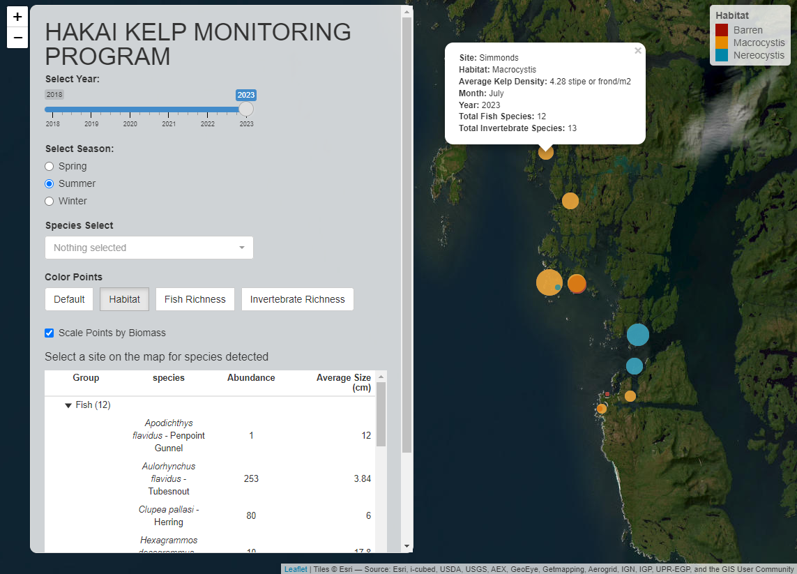

# Hakai Kelp Monitoring Program v1.0.0

Welcome! This is an interactive application meant to help explore community data from the [Hakai rocky subtidal fish and invertebrate swath data from BC Central Coast](https://catalogue.hakai.org/dataset/ca-cioos_35beb32e-8dc9-42ab-9630-2ae23e414026).\
All questions should be directed to the app developer Alex Schmill ([alex.schmill\@hakai.org](mailto:alex.schmill@hakai.org))   Explore the app at: <https://alexschmill.shinyapps.io/kelp_monitoring/>

## Data Structures

1.  **`site_coords`**:
    -   Description: Contains spatial and temporal data for monitoring sites.
    -   Key Columns: `sample`, `fish_richness`, `dominant_habitat`, `site`, `period`, `mean_density`, `year`, `invert_richness`, `lat`, `long`, `substrate`, `month`.
2.  **`full_spp_list`**:
    -   Description: Lists all species available for selection per project.
    -   Format: Character vector with HTML-encoded species names.
3.  **`site_spp_list`**:
    -   Description: Site-level species data. Displayed in the table produced when a site is selected.
    -   Format: Character vector with HTML-encoded species names.
    -   Structure: A list where each element corresponds to a site and contains a data frame with columns like `sample`, `site`, `year`, `month`, `period`, `Group`, `species`, `Abundance`, `Average Size (cm)`.

## Key Features

1.  Interactive map with species-specific highlighting.
2.  Reactable table that dynamically updates based on map clicks.
3.  UI elements (e.g., species picker) support HTML formatting.
4.  Dynamic filtering based on the program, year, season, and species.
